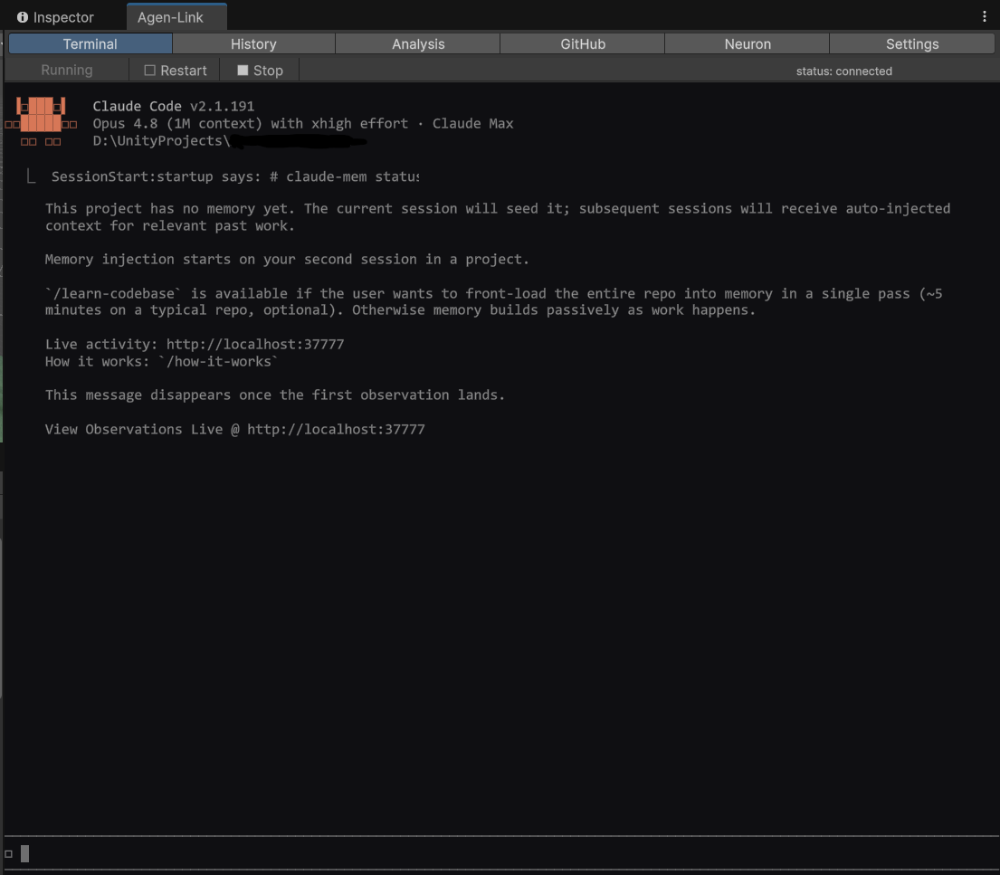
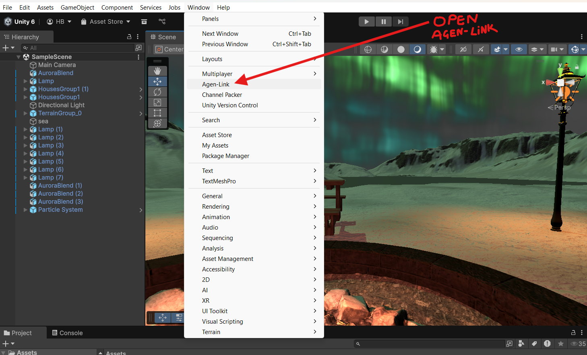
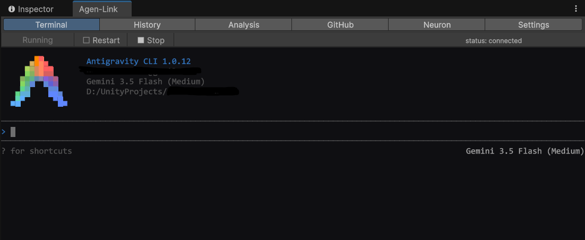
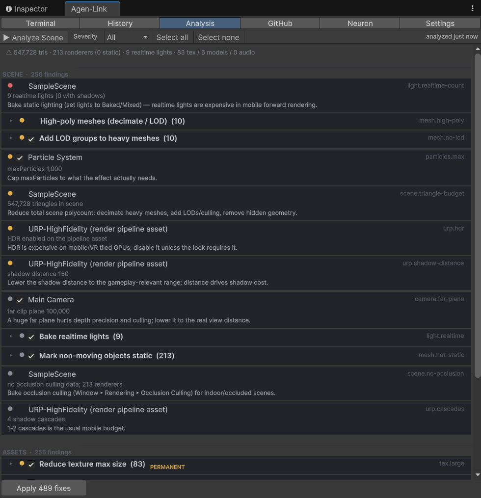
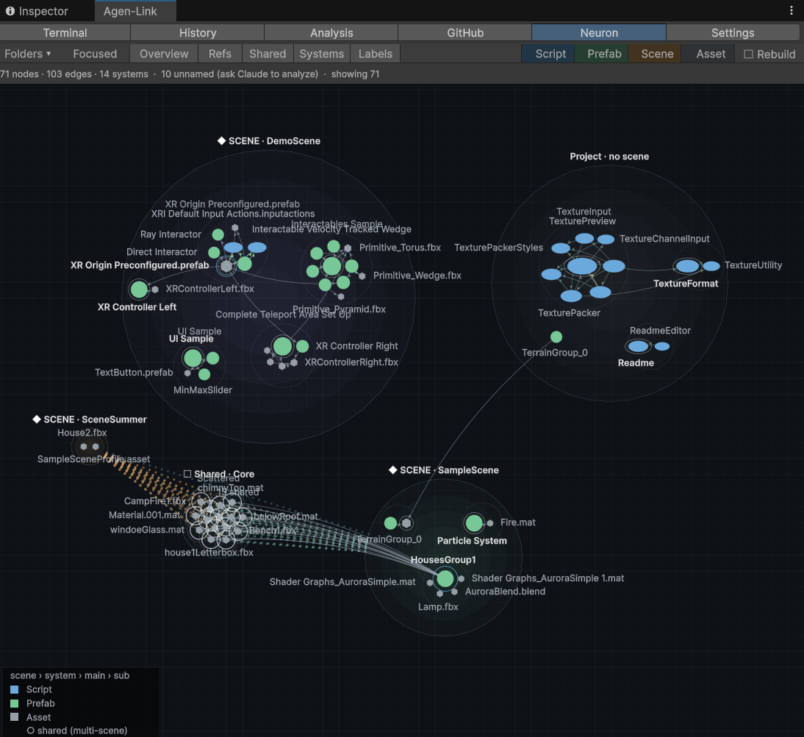
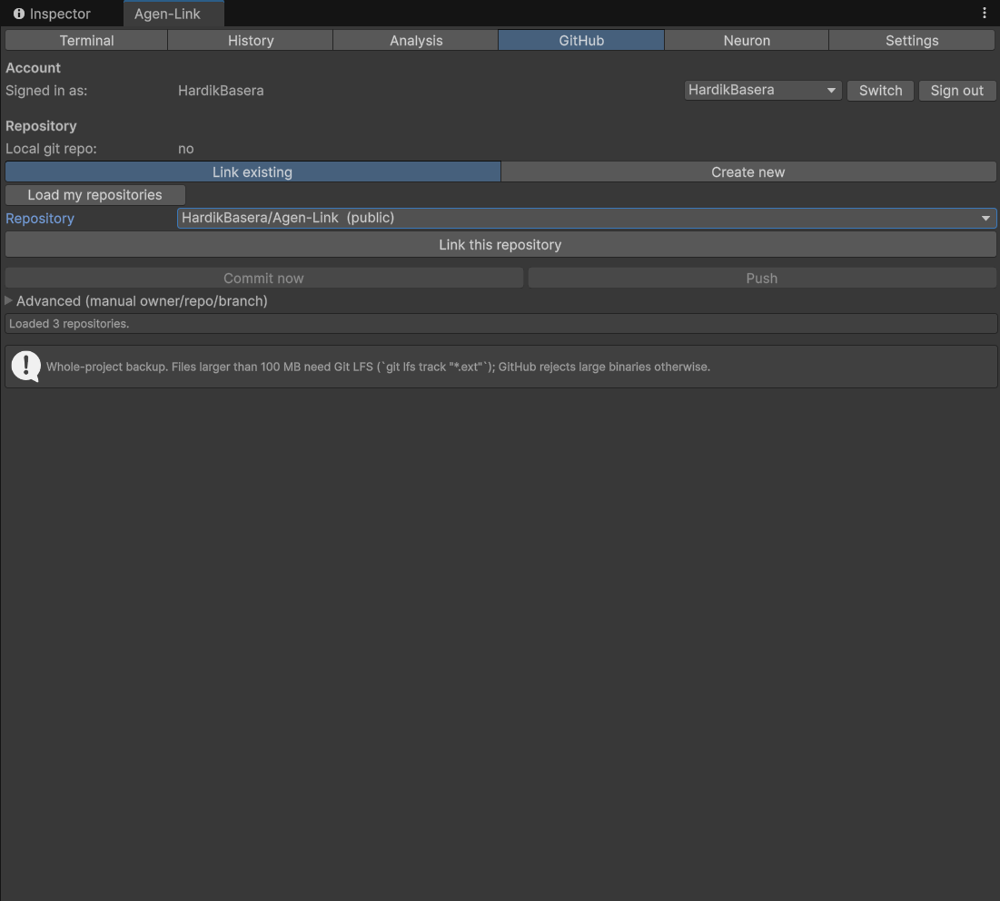
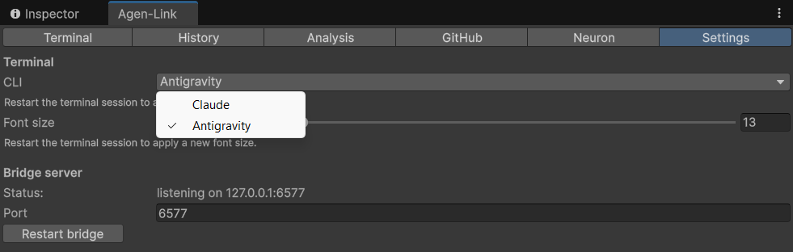

# Agen-Link

> Run a real AI coding CLI **inside the Unity Editor** — **Claude Code** or Google **Antigravity** — wired to a **live MCP bridge** so the AI can see and act on your open Editor.

[](LICENSE)
[](https://github.com/HardikBasera/Agen-Link/releases)


<p align="center">
  
</p>

## About

**Agen-Link** embeds a real terminal — running either the **Claude Code** CLI or Google's **Antigravity** (`agy`) CLI — directly in a Unity Editor window, and connects it to a **live MCP bridge**. Through that bridge the AI can read and act on your open Editor: Console logs, compile errors, the scene hierarchy, assets, a project knowledge graph, and a one-click scene-optimization auditor. You can also browse your past AI sessions, map your project as a graph, and back the whole project up to GitHub — all without leaving Unity.

Most MCP setups have an **external** chat app drive Unity. Agen-Link **inverts that**: *Unity hosts the CLI*, and the MCP server is the AI's window back into the live Editor. You keep your own CLI login, skills, plugins, and slash-commands — the Unity bridge is just added on top.

`Window ▸ Agen-Link` opens a six-tab panel:

- **Terminal** — the embedded AI CLI (Claude or Antigravity). The session **survives script recompiles** (it reconnects and replays).
- **Analysis** — one-click scene + asset optimization audit, play-mode performance profiling, and safe, Undo-able auto-fixes.
- **History** — a read-only browser of your past AI conversations for this project, grouped by date.
- **Neuron** — a live, Assets-only knowledge graph of your scripts / prefabs / scenes, auto-grouped into named "systems".
- **GitHub** — whole-project backup with a browser sign-in (no passwords typed into Unity).
- **Settings** — choose the CLI, font size, bridge port, and tool paths.

> **Platform:** Windows 10/11. **Unity:** 2021.3+ (tested on 2022.3 LTS and Unity 6).

## Requirements

**Install these yourself first** (one time per PC):

| Tool | How to install | Why |
|------|----------------|-----|
| **Unity 2021.3+** | [unity.com/download](https://unity.com/download) (via Unity Hub) | the editor Agen-Link plugs into |
| **Node.js 18+** | [nodejs.org](https://nodejs.org) | runs the MCP server and the terminal host |
| **An AI CLI** (at least one) | see below | the Terminal tab needs Claude and/or Antigravity |

**AI CLI — install at least one of these:**

- **Claude Code** — in any terminal:
  ```powershell
  npm install -g @anthropic-ai/claude-code
  ```
  Then run `claude` once and log in.

- **Google Antigravity (`agy`)** — install the Antigravity CLI from
  [antigravity.google/docs/cli-install](https://antigravity.google/docs/cli-install), then run `agy`
  once to sign in.

**You do _not_ need to pre-install these — `setup.cmd` (next section) handles them for you:**

- **GitHub CLI (`gh`)** — installed automatically (used only by the GitHub backup tab).
- **`node-pty`** (the native terminal engine) and the **MCP server build** — downloaded / built automatically.

## Install

Setup has two parts: **one-time** steps you do once per PC, and **per-project** steps you repeat in every Unity project where you want Agen-Link.

### Part A — one time per PC

1. **Install the requirements above** — Unity, Node 18+, and at least one AI CLI (Claude and/or Antigravity).

2. **Download Agen-Link** — clone the repo, or click the green **`Code ▸ Download ZIP`** button above and extract it to a permanent location. (Don't move or rename the folder after setup — the helpers are found by their location.)

3. **Run the setup** — open the `install` folder and **double-click `setup.cmd`**. A console window opens, does its work, and **stays open at the end** so you can read the result.

   <details>
   <summary><b>What does <code>setup.cmd</code> actually do?</b> (nothing hidden — click to expand)</summary>

   `setup.cmd` is a tiny launcher that runs `install/lib/setup.ps1`. That script:

   1. **Builds the MCP server** — `npm install` then `npm run build` in `mcp-server/`.
   2. **Installs the terminal host** — `npm install` in `pty-host/` (this fetches the native **`node-pty`**).
   3. **Installs the GitHub CLI (`gh`)** via `winget`, *if* it isn't already installed (for the GitHub tab).
   4. **Checks** whether the optional **Antigravity** CLI is present (it doesn't install it).

   It only **builds and installs the local helpers** — it never edits your Unity projects and binds nothing to the network. It uses `-ExecutionPolicy Bypass` because Windows blocks scripts downloaded from the internet; that's also why you should run `setup.cmd` and **not** double-click `lib\setup.ps1` directly (that would fail and close instantly).
   </details>

   <details>
   <summary>Prefer to run those steps <b>manually</b> instead of <code>setup.cmd</code>?</summary>

   Open a terminal in the Agen-Link folder and run:

   ```powershell
   # 1) Build the MCP server
   cd mcp-server
   npm install
   npm run build
   cd ..

   # 2) Install the terminal host (downloads native node-pty)
   cd pty-host
   npm install
   cd ..

   # 3) Install the GitHub CLI — optional, only for the GitHub backup tab
   winget install --id GitHub.cli -e --source winget
   ```

   That's exactly what `setup.cmd` runs. (The Antigravity CLI, if you want it, is installed separately — see **Requirements**.)
   </details>

### Part B — in every Unity project

4. **Add the package** — in your Unity project, open `Window ▸ Package Manager ▸ + ▸ Add package from disk…` and pick:

   ```
   …\Agen-Link\unity-package\package.json
   ```

5. **Open the window** — `Window ▸ Agen-Link`. The Unity Console should log `[Agen-Link] Listening on 127.0.0.1:6577`.

   <p align="center">
     
   </p>

6. **Start a session** — go to the **Terminal** tab and press **Start session**. Pick your CLI (Claude or Antigravity) in the **Settings** tab if needed, then type a prompt. That's it — the AI now sees your live Editor.

> **Tip:** the native `node-pty` and the MCP server build are machine-specific (and git-ignored), so run `install\setup.cmd` once on each new PC. Step 4 (add the package) is repeated per Unity project.

## The tabs

### Terminal — Claude or Antigravity, inside Unity

The real CLI, in an Editor window, with the Unity bridge wired in. Sessions survive script recompiles (domain reloads) — they reconnect and replay automatically. Switch between Claude and Antigravity in **Settings**; both share the same project memory.

<p align="center">
  
</p>

### Analysis — one-click scene & asset optimization

Audit the open scene and your assets for optimization issues (per-renderer polycounts, realtime lights, batching, LODs, textures, audio, render-pipeline settings…), profile play-mode performance, and apply **whitelisted, Undo-able** fixes in bulk.

<p align="center">
  
</p>

### Neuron — a live knowledge graph of your project

An Assets-only graph of your scripts, prefabs, and scenes and how they wire together — auto-grouped into named "systems" so the AI (and you) can reason about the project's structure.

<p align="center">
  
</p>

### GitHub — whole-project backup

Sign in through your browser (no passwords typed into Unity), link or create a repo, and commit/push the whole project as a backup.

<p align="center">
  
</p>

### Settings — CLI, font, and the localhost bridge

Choose the CLI (Claude / Antigravity), set the terminal font size, and see the bridge status. The bridge listens on **`127.0.0.1`** only.

<p align="center">
  
</p>

## How it works

Three processes keep the AI session alive across Unity's domain reloads (recompiles):

- A tiny **TCP bridge** (`127.0.0.1:6577`) runs inside the Editor and executes every request on the
  main thread. The **Node MCP server** connects to it and exposes live-editor tools to the CLI:
  `agen_get_project_info`, `agen_read_console`, `agen_get_compile_errors`, `agen_refresh_assets`,
  `agen_get_scene_hierarchy`, `agen_get_selection`, `agen_find_assets`, the scene-analysis tools
  (`agen_audit_scene`, `agen_audit_assets`, `agen_perf_*`, `agen_apply_fixes`), the Neuron graph
  tools (`agen_graph_*`), and shared project-memory tools (`agen_memory_*`).
- The **Terminal** launches the CLI through a detached **pty-host** (Node + Windows ConPTY) that the
  Editor talks to over a localhost socket. It authenticates with a per-session token, replays a ring
  buffer on reconnect, and watches the parent Editor PID — so the session survives recompiles and is
  torn down when Unity exits.
- Both CLIs share one **local project memory** (an `AGENTS.md` plus the `agen_memory_*` tools), so you
  don't have to re-explain the project when you switch between them.

## Scope & safety

- The Terminal runs the **real** AI CLI with your own configuration — it has whatever access your
  normal CLI does. The Unity bridge only **adds** live-editor awareness; it doesn't restrict the CLI.
- Your safety nets are **git** (the GitHub tab) and Unity's own Undo. Scene auto-fixes are Undo-able
  and never auto-saved; asset-import fixes reimport immediately (and are flagged as permanent).
- The bridge listens only on **localhost** (`127.0.0.1`) and is skipped in Asset Import Worker processes.

## Security

Agen-Link runs on your machine and is designed to stay local:

- **Localhost only.** The Editor bridge (`127.0.0.1:6577`) and the terminal host (an ephemeral
  `127.0.0.1` port) never bind to a network-facing interface. **Don't reconfigure the bridge to
  `0.0.0.0`** — that would expose the live Editor to your network without authentication.
- **The CLI keeps your access.** The terminal runs the *real* Claude / Antigravity CLI with your
  own login; the bridge only **adds** live-editor awareness, it doesn't sandbox the CLI. If your
  CLI account or machine is compromised, so is the bridge.
- **One write-capable tool.** Most `agen_*` tools are read-only. `agen_apply_fixes` applies
  whitelisted scene/asset fixes — review audit findings first. Scene edits are Undo-able and not
  auto-saved; asset-import edits reimport immediately.
- **Don't log secrets.** The bridge can read the Unity Console — keep API keys/tokens out of it,
  in git-ignored config loaded at runtime.

Found a vulnerability? Please report it privately — see [SECURITY.md](SECURITY.md). Don't open a
public issue for security problems.

## Troubleshooting

- **"Failed to start on port 6577"** → another Editor may hold the port; change it in **Settings ▸ Bridge server**.
- **Terminal: "pty-host is not built"** → run `install/setup.cmd` (installs `node-pty`), then restart Unity.
- **"MCP server not found"** → run `install/setup.cmd` (or `npm run build` in `mcp-server/`); set the path in Settings.
- **GitHub: `gh` not found** → run `install/setup.cmd`, then restart Unity so it picks up the new PATH.

## Layout

```
unity-package/   Unity package (Editor C#): bridge, window, Terminal, Analysis, History, GitHub, Neuron graph
pty-host/        Node terminal host (Windows ConPTY) for the embedded Terminal
mcp-server/      Node / TypeScript MCP server (src/ → build/)
install/         setup.cmd (double-click) + lib/setup.ps1 (the build script it runs)
```

## Contributing

Contributions are welcome! Please read **[CONTRIBUTING.md](CONTRIBUTING.md)** for the fork →
pull-request workflow, the local dev setup, and the project conventions (notably: rebuild and
commit `mcp-server/build/`, and no `package.json` install scripts). By participating you agree to
the [Code of Conduct](CODE_OF_CONDUCT.md).

## License

Licensed under the **[Apache License 2.0](LICENSE)**. Copyright © 2026 Hardik Basera. See
[NOTICE](NOTICE) for third-party attributions.
